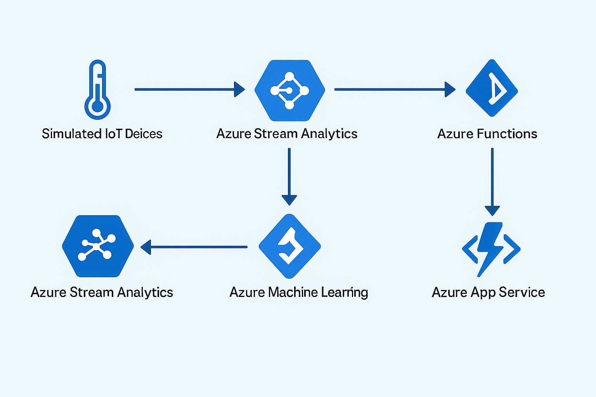

# IoT Anomaly Detection

## Introduction

This project implements an end-to-end IoT anomaly detection system using Azure cloud services. It simulates IoT devices sending temperature data, processes the data through a machine learning model to detect anomalies, sends alerts for detected anomalies, and displays the results on a real-time dashboard. The system leverages multiple Azure services to create a scalable, cloud-based solution for monitoring IoT data, with a focus on learning and experimenting with Azure’s capabilities.

The project uses a simple PyTorch autoencoder model for anomaly detection (in our case only temperature anomalies) due to cost constraints, but the architecture is designed to be scalable for more complex models and larger datasets with increased resources.

---

## Architecture

Below is the architecture of the system, showing the flow of data through various Azure services:



- **Simulated IoT Devices**: Generate synthetic temperature data with anomalies (In production , it will be replaced by the actual IoT device)
- **Azure IoT Hub**: Receives data from simulated devices.
- **Azure Stream Analytics**: Processes data and forwards it to the ML model.
- **Azure Machine Learning**: Hosts a PyTorch autoencoder for anomaly detection.
- **Azure Functions**: Triggers alerts (e.g., email) when anomalies are detected.
- **Azure Cosmos DB**: Stores inference results and alerts.
- **Azure App Service**: Hosts a React dashboard to display data and alerts.
- **Azure SignalR Service**: Pushes real-time updates to the dashboard.


---

## Steps to Replicate the Project

### 1. Clone the Repository

```bash
git clone <https://github.com/manticore999/iot-anomaly-detection>
cd IOT-ANOMALY-DETECTION
```

### 2. Set Up Python Environment

- Install Python 3.10.

- Install the required dependencies:

```bash
pip install \
  torch==2.3.0 \
  numpy==1.26.4 \
  azureml-core==1.56.0 \
  azureml-inference-server-http==1.4.0 \
  azure-functions==1.21.1 \
  requests==2.32.3 \
  azure-iot-device==2.13.2 \
  azure-cosmos==4.7.0
```

### 3. Set Up Azure IoT Hub

1. Create an IoT Hub in Azure.
2. Register a device and obtain the device connection string.
3. Set the connection string as an environment variable:

```bash
export IOTHUB_DEVICE_CONNECTION_STRING="your-connection-string"
```

### 4. Generate and Send IoT Data

Run the data generation script to simulate IoT devices sending data to IoT Hub:

```bash
python data_generation/generate_iot_data.py
```

### 5. Set Up Azure Stream Analytics

1. Create a Stream Analytics job in Azure.
2. Configure the input as IoT Hub.
3. Configure two outputs:
   - One to the Azure Machine Learning endpoint.
   - One to Azure Cosmos DB.
4. Use a query to process data, e.g.:

```sql
SELECT deviceId, temperature, timestamp
INTO [ML-Endpoint-Output]
FROM [IoTHub-Input]
WHERE temperature IS NOT NULL;

SELECT deviceId, temperature, timestamp,
       MLModel(temperature).reconstruction_error AS reconstruction_error
INTO [CosmosDB-Output]
FROM [IoTHub-Input];
```

### 6. Train and Deploy the ML Model

- Train the autoencoder model:

```bash
python ml_model/train_autoencoder.py
```

- Deploy the model to Azure Machine Learning using `ml_model/score.py`:
  1. Register the model in Azure ML.
  2. Create an inference configuration with `score.py`.
  3. Deploy to an endpoint (e.g., Azure Container Instance).

### 7. Set Up Azure Functions

- Deploy the function in `functions/function_app.py` to Azure Functions:
  1. Create a Function App in Azure.
  2. Deploy the function using Azure CLI or VS Code.

- Configure environment variables for Cosmos DB endpoint, key, and email settings.

### 8. Set Up Azure Cosmos DB

- Create a Cosmos DB account, database (`AnomalyDB`), and container (`Results`).

### 9. Set Up the Dashboard

```bash
cd dashboard

# Install Node.js dependencies
npm install react@18.3.1 react-dom@18.3.1 @microsoft/signalr@8.0.7 react-scripts@5.0.1

# Start the dashboard
npm start
```

The dashboard will run on `http://localhost:3000`.

### 10. Configure Azure SignalR Service

1. Create a SignalR Service in Azure.
2. Update the SignalR endpoint URL in `dashboard/src/App.js` (e.g., replace `http://localhost:7071/api` with your SignalR endpoint).
3. Ensure the Azure Function sends messages to SignalR.

---

## Resources Needed

### Azure Services

- **Azure IoT Hub**: To receive IoT data.
- **Azure Stream Analytics**: To process data in real-time.
- **Azure Machine Learning**: To train and deploy the anomaly detection model.
- **Azure Functions**: To send alerts.
- **Azure Cosmos DB**: To store inference results.
- **Azure App Service**: To host the React dashboard.
- **Azure SignalR Service**: For real-time updates to the dashboard.

### Tools

- **Python 3.10**: For running the data generation, training, and Function scripts.
- **Node.js and npm**: For running the React dashboard.
- **Azure CLI**: For deploying services and managing Azure resources.
- **Git**: For cloning the repository.

---

## Pipeline Explanation

1. **Data Generation**: `data_generation/generate_iot_data.py` generates synthetic temperature data (~25°C with occasional anomalies ~35–45°C) and sends it to Azure IoT Hub using the Azure IoT Device SDK.
2. **IoT Hub**: Receives the data and makes it available for downstream processing.
3. **Stream Analytics**: Processes the data in real-time, forwards it to the Azure Machine Learning endpoint for inference, and stores the results in Azure Cosmos DB.
4. **Machine Learning**: The deployed autoencoder model (`ml_model/score.py`) reconstructs the temperature data and calculates reconstruction errors to detect anomalies (errors > 0.01 indicate anomalies).
5. **Azure Functions**: `functions/function_app.py` retrieves inference results, checks for anomalies, stores results in Cosmos DB, and sends email alerts for detected anomalies.
6. **Cosmos DB**: Stores the inference results (temperature, reconstruction error, anomaly status) for persistence and retrieval.
7. **App Service (Dashboard)**: The React app (`dashboard/src/App.js`) displays the temperature data, reconstruction errors, and anomaly statuses in a table, with styling to highlight anomalies.
8. **SignalR Service**: Pushes real-time alerts to the dashboard (`dashboard/src/SignalRService.js`), ensuring users see anomaly notifications immediately.

---

## Project Goals and Scalability

The primary goal of this project is to familiarize with Azure and its cloud services, providing hands-on experience with integrating various Azure components in a real-world scenario. Due to cost constraints, the anomaly detection model is relatively simple (a PyTorch autoencoder with a small architecture), and the dataset is synthetic and small-scale. However, the system is designed to be scalable: with increased budget, you can enhance the model complexity (e.g., deeper neural networks), process larger datasets, and deploy to more robust compute resources (e.g., Azure Kubernetes Service instead of ACI). This scalability ensures the architecture can handle real-world IoT deployments with minimal changes.

---

## Contributing

Feel free to fork the repository and submit pull requests for improvements.

---

## License

This project is licensed under the MIT License.

